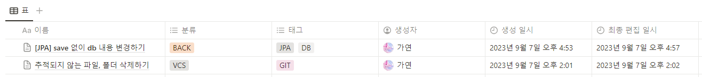

 

## 0904

 

# api 명세서 회의

- 요청, 응답 데이터 변경
- 필요없는 api 삭제
- 필요한 api 추가

 

# db ERD 회의

- 카드 데이터 테이블 확인

 

# 프로젝트 생성

- spring initializr 프로젝트 생성

 

## 0905

 

# db ERD 회의

- 테이블 추가
- 사용자 테이블 컬럼 수정

 

# 로그인, 인증 구현

- spring security 적용
- JWT 인증 구현
- 요청 인증 구현

## 0906

 

# 개발

- 회원가입 기능 구현
- 회원가입 테스트
- 로그인 기능 구현
- 로그인 테스트

 

## 0907

# 개발

- 로그인 후 인증 토큰 만료 시 403 에러 반환
- 인증 토큰 만료 시 refresh token을 함께 보내면 토큰 재발급

 

- 회원가입 시 이메일 인증 및 중복 체크

 

# 정리

 

## 0911

 

# 개발

- 아이디 찾기
- 비밀번호 찾기
  - 인증 이메일 전송
- 회원 정보 수정
  - 기존 비밀번호 확인

 

# 회의

- Jira 회의
- Jira Trigger 설정
  - 연결된 모든 작업 이슈 완료 시 -> 스토리 자동 완료 (테스트 확인 전)

 

# 정리

- JPA 새 entity 만들어서 저장하면 @DynamicUpdate 적용 안됨
- 암호화 적용된 비밀번호와 일치하는지 확인 시 encoder.matches() 사용
